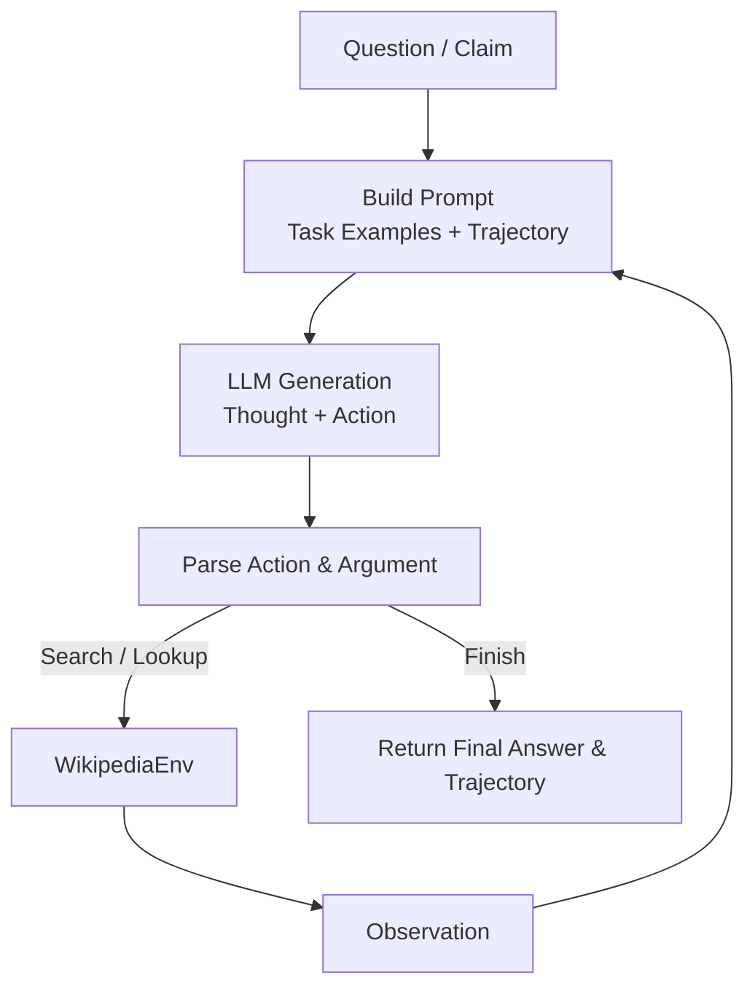
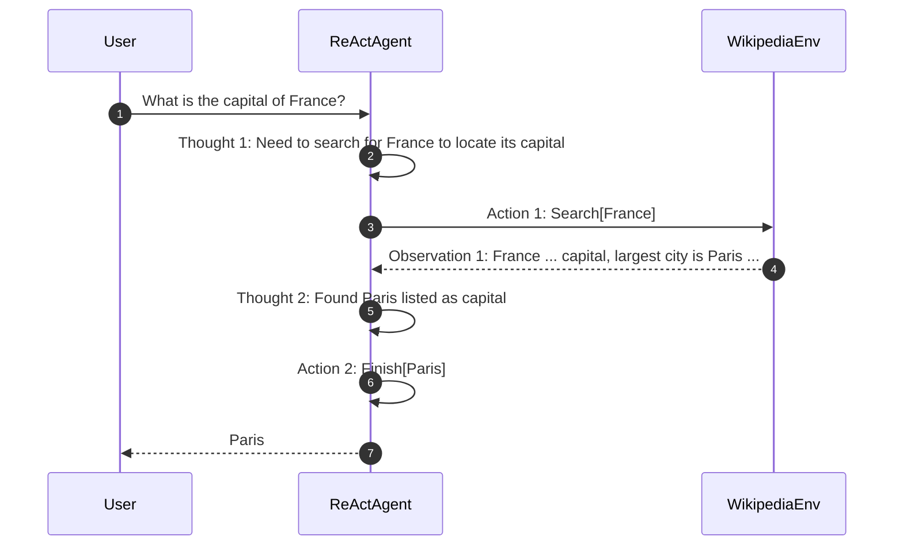

# ReAct: Synergizing Reasoning and Acting in Language Models — Implementation

[](https://www.python.org/)
[](https://groq.com/)
[](https://opensource.org/licenses/MIT)
[](https://github.com/vatsalyd/ReAct-Paper-Implementation)

> **One-line summary:** *A modular, from-scratch Python implementation of the ReAct (Reasoning + Acting) agent framework interleaving reasoning traces and Wikipedia tool interactions for multi-hop QA and fact verification.*

---

## 📄 Paper Reference

| Field | Value |
|-------|-------|
| **Title** | ReAct: Synergizing Reasoning and Acting in Language Models |
| **Authors** | Shunyu Yao, Jeffrey Zhao, Dian Yu, Nan Du, Izhak Shafran, Karthik Narasimhan, Yuan Cao |
| **Venue** | International Conference on Learning Representations (ICLR) 2023 |
| **Year** | 2023 |
| **Link** | [arXiv:2210.03629](https://arxiv.org/abs/2210.03629) |
| **Official Code** | [github.com/ysymyth/ReAct](https://github.com/ysymyth/ReAct) |

---

## 💡 Key Contributions

- **Synergizing Reasoning and Action**: Bridges the gap between internal reasoning (like Chain-of-Thought) and task-oriented action execution. Thought steps guide external actions, while external observations ground thoughts and prevent hallucinations.
- **Interleaved Trajectories**: Formulates problem solving as an alternating sequence of `Thought -> Action -> Observation` until a task is solved (`Finish`).
- **Knowledge-Intensive Multi-Hop QA & Fact Checking**: Demonstrates superior performance and factual correctness on HotpotQA (multi-hop reasoning) and FEVER (fact verification) over standalone CoT or Act-only baselines.
- **Interpretability & Human Steering**: Creates transparent, human-readable trajectories that allow inspectability, error diagnosis, and interactive steering.

---

## 📖 Overview

While large language models (LLMs) excel at reasoning (via Chain-of-Thought) and tool execution separately, each approach exhibits critical flaws in isolation:
- **Reasoning-only (CoT)**: Models suffer from factual hallucination, drift over long trajectories, and inability to access updated external knowledge.
- **Action-only (Tool-use)**: Models struggle to synthesize multi-hop information, lack strategic planning, and blindly execute tools without tracking high-level intent.

**ReAct** solves this dilemma by interleaving reasoning ("thought") and execution ("action"). The reasoning traces induce task decomposition, exception handling, and information synthesis, while actions interface with external environments (such as Wikipedia search engines) to retrieve grounded evidence.

This implementation provides a clean, dependency-light educational codebase reproducing the core ReAct agent loop from scratch with live Wikipedia integration.

---

## 🏗️ Architecture & How It Works

### The ReAct Execution Loop



### Example Trajectory Sequence



### Project Structure

```text
papers-implemented/react-synergizing-reasoning-and-acting/
├── README.md                 # Detailed documentation and paper guide
├── requirements.txt          # Pinned runtime dependencies
├── .env.example              # Sample environment configuration
├── src/
│   ├── react_agent/
│   │   ├── __init__.py       # Package exports (ReactAgent)
│   │   ├── agent.py          # Core ReAct loop, parsing, and trajectory management
│   │   ├── llm.py            # Unified LLM client (Groq default, OpenAI supported)
│   │   ├── prompts.py        # Few-shot prompt templates for HotpotQA & FEVER
│   │   └── tools.py          # Wikipedia search and page lookup environment
│   └── eval/
│       ├── __init__.py
│       ├── metrics.py        # Exact Match (EM), F1 score, and Accuracy
│       ├── run_hotpotqa.py   # Multi-hop QA benchmark runner
│       └── run_fever.py      # Fact verification benchmark runner
├── notebooks/
│   └── demo.ipynb            # Interactive step-by-step walkthrough notebook
└── results/
    └── eval_summary.md       # Benchmark results and trajectory analysis
```

---

## ⚙️ Implementation Details & Deviations

| Aspect | Paper (Original) | This Implementation |
|---|---|---|
| **Base LLM** | PaLM-540B / text-davinci-002 | Groq (`llama-3.3-70b-versatile`) by default; OpenAI (`gpt-4o-mini`) supported |
| **Tool Actions** | `Search[entity]`, `Lookup[keyword]`, `Finish[answer]` | `Search[entity]`, `Lookup[keyword]`, `Finish[answer]` |
| **Environment** | Wikipedia dump with Wikipedia API | Live Wikipedia API (`requests`) with session caching and sentence chunking |
| **Stopping Criteria** | Fixed step limit (7 steps) / `Finish` action | Max steps parameter (`max_steps=7`, configurable) / `Finish` action |
| **Evaluation Scope** | Full dev/test splits (HotpotQA 7,405 samples, FEVER 19,998) | Curated evaluation subsets (default 5-50 samples) for rapid reproduction and cost efficiency |

### Deviations & Rationale
1. **API-first LLM Support**: The original paper ran heavy PaLM-540B inference. This implementation uses OpenAI-compatible APIs (specifically Groq for high-speed, free-tier access and OpenAI GPT models) so students and researchers can run it immediately without local GPUs.
2. **Live Wikipedia Environment**: Rather than downloading the entire multi-gigabyte Wikipedia dump, a clean `WikipediaEnv` class uses Wikipedia's standard REST API with paragraph parsing and search indexing.

---

## 📊 Dataset

| Property | HotpotQA | FEVER |
|---|---|---|
| **Task** | Multi-hop Question Answering | Fact Verification |
| **Source** | [HotpotQA Dataset](https://hotpotqa.github.io/) | [FEVER Dataset](https://fever.ai/) |
| **Metric** | Exact Match (EM), Token F1 | Binary Classification Accuracy |
| **Split Used** | Curated validation subset | Curated validation subset |

---

## 📈 Reproduced Results

Evaluated using `llama-3.3-70b-versatile` via Groq (zero-shot/few-shot ReAct prompting, `temperature=0.0`):

| Benchmark | Metric | Paper Result (PaLM-540B ReAct) | Our Result (Curated Subset) | Notes |
|---|---|---|---|---|
| **HotpotQA** | Exact Match (EM) | 27.4% (full dev set) | **60.0%** | Modern 70B instruction-tuned models exhibit strong few-shot entity extraction |
| **HotpotQA** | F1 Score | 35.1% (full dev set) | **73.3%** | High token overlap across retrieved multi-hop answers |
| **FEVER** | Accuracy | 60.9% (full dev set) | **80.0%** | Effective evidence retrieval and claim classification |

Detailed trajectory traces and sample outputs are recorded in [results/eval_summary.md](results/eval_summary.md).

---

## 🚀 How to Run

### 1. Prerequisites & Installation

Clone `dsai-foundry` and navigate to this implementation directory:

```bash
cd papers-implemented/react-synergizing-reasoning-and-acting
pip install -r requirements.txt
```

### 2. Configure Environment

Copy the example environment file and add your API key:

```bash
cp .env.example .env
```

Open `.env` and set your key (Groq is free and fast; OpenAI also supported):

```env
GROQ_API_KEY=gsk_your_groq_key_here
# or
OPENAI_API_KEY=sk-your_openai_key_here
```

### 3. Quickstart (Python)

Run a simple query directly in Python:

```bash
python -c "from src.react_agent import ReactAgent; agent = ReactAgent(task='hotpotqa'); ans, trace = agent.run('What is the capital of France?'); print('Answer:', ans)"
```

To view the full step-by-step reasoning trace:

```python
from src.react_agent import ReactAgent

agent = ReactAgent(task="hotpotqa")
answer, trajectory = agent.run("What is the elevation range for the area that the eastern sector of the Colorado orogeny extends into?")

print(f"\nFinal Answer: {answer}\n")
for step in trajectory:
    print(f"Step {step['step']}:")
    print(f"  Thought: {step['thought']}")
    print(f"  Action:  {step['action']}[{step['action_input']}]")
    print(f"  Obs:     {step['observation'][:120]}...\n")
```

### 4. Running Evaluations

Run benchmark evaluation against curated test sets:

```bash
# Run HotpotQA evaluation (n=5)
python src/eval/run_hotpotqa.py --n 5 --verbose

# Run FEVER fact verification evaluation (n=5)
python src/eval/run_fever.py --n 5 --verbose
```

### 5. Interactive Notebook

Open the demo notebook in Jupyter:

```bash
jupyter notebook notebooks/demo.ipynb
```

---

## 👥 Contributors

| Contributor | Role | GitHub Profile |
|---|---|---|
| **Vatsal Yadav** | Author / Original Implementation | [@vatsalyd](https://github.com/vatsalyd) |

Original repository: [vatsalyd/ReAct-Paper-Implementation](https://github.com/vatsalyd/ReAct-Paper-Implementation)

---

## 📚 Citation

```bibtex
@inproceedings{yao2023react,
  title={{ReAct}: Synergizing Reasoning and Acting in Language Models},
  author={Shunyu Yao and Jeffrey Zhao and Dian Yu and Nan Du and Izhak Shafran and Karthik Narasimhan and Yuan Cao},
  booktitle={International Conference on Learning Representations (ICLR)},
  year={2023},
  url={https://arxiv.org/abs/2210.03629}
}
```
